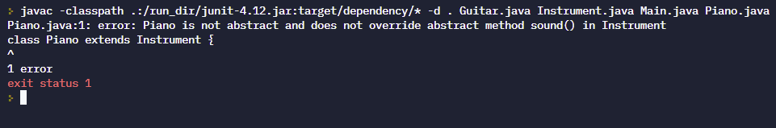

# Instructions  

### Description:
In this activity you will learn about how to use **abstract** classes. An **abstract** class is a class which cannot be instantiated directly using the class' constructor, and is used with inheritance to create superclasses in which other, specific implementation can exist. **Abstract** classes also provide the benefit of being able to declare **abstract** methods within the class, which enforces a subclass to provide an overridden version of that method.

For this assignment, we will walk you through the creation of an **abstract** class, and subclass, then ask you to create several other implementations. 

## Steps
1. First, we will create our **abstract** Instrument class. Use the new file button to create a new file called 'Instrument.java'.
2. Copy the following code snippet into this class:
```Java
abstract class Instrument {
  
  abstract void sound();
  
}
```
To create an **abstract** class, you simply use the keyword `abstract` in the class definition. Notice also that we have used the `abstract` keyword in the class when declaring the method `sound()`. You can declare methods as **abstract** within a class, if the class is also **abstract**. When a method is declared as **abstract** you cannot declare a body for the method. Instead of a set of curly braces specifying the statements to execute when `sound()` is invoked, we can simply end the declaration with a semi-colon.

3. Next, we will create a subclass of our Instrument class. Use the new file button to create a file called 'Guitar.java'.
4. Copy the following snippet into this new file:
```Java
class Guitar extends Instrument {

  @Override
  void sound(){
    System.out.println("Strings thrum");
  }

}
```
Here, we are using the keyword `extends` to establish that Guitar is a subclass of the Instrument class. Since Guitar is not abstract, we now need to override the **abstract** method `sound()` which was inherited. Note that we included the `@Override` annotation in this snippet. The annotation is not actually required, but we've included it since the annotation communicates clearly which method was inherited, and that we are explicitly changing the functionality. When a non-abstract subclass inherits **abstract** methods, the class ***must*** provide an implementation for the method.

5. Let's take a moment to verify our functionality. In `main()` method of your **Main** class, add the following code snippet and run your program:
```Java
Guitar guitar = new Guitar();
guitar.sound();
```
You should see the following output:
```
Strings thrum
```

6. Now, lets walk through the creation of one more class. This time, lets see what happens when we do not override the inherited abstract method. First, add the following snippet to your `main()` method, below the code that already exists:
```Java
Piano piano = new Piano();
piano.sound();
```
We haven't created the piano class just yet, so your code may be underlined in red. Don't worry, we'll create that class now.

7. Use the new file button to create a file and name is 'Piano.java'.
8. Add the following code to the new file:
```Java
class Piano extends Instrument {
  
}
```
Notice that we are not overriding the method `sound()` this time. Again, you may see part of your code underlined in red. For now, we will ignore the error.

9. Go back to your **Main** class and try to run your program. You should see the following error message:

Since the class Piano is not abstract, and does not override the inherited abstract method `sound()`, we receive an error.
10. Return to the 'Piano.java' file and add the following code to the class:
```Java
void sound(){
  System.out.println("Keys clank");
}
```
Return to the Main class once more and run the code again. This time you should see:
```
Strings thrum
Keys clank
```
Great! Now that you now how to properly utilize an abstract class and override the required abstract class methods, its time to get some additional practice!

11. Your Turn! Create two more subclasses for Instrument a 'Violin' class and a 'Drums' class. Create a new file for each one. Remember that both of these classes should extend the Instrument class.
12. Override the `sound()` method in both classes. In the implementation, for violin's `sound()` method print out "Strings twang", and "Drums go boom" for the drums.
13. In your `main()` method, Create a Violin and Drums object and invoke the `sound()` method on each.
14. Verify your functionality using the test provided.

### Test:
Use the test provided. 

#### Sample output:
```
Strings thrum
Keys clank
Strings twang
Drums go boom
```
  
  